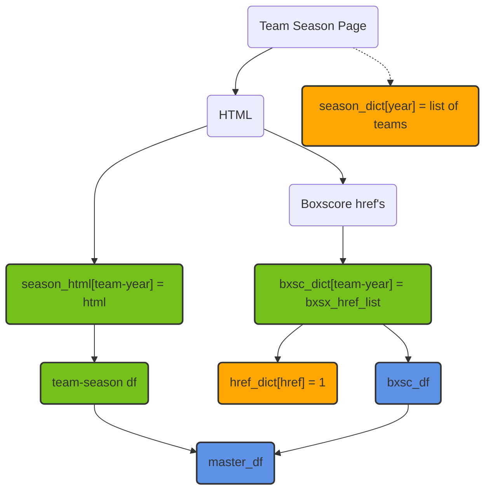
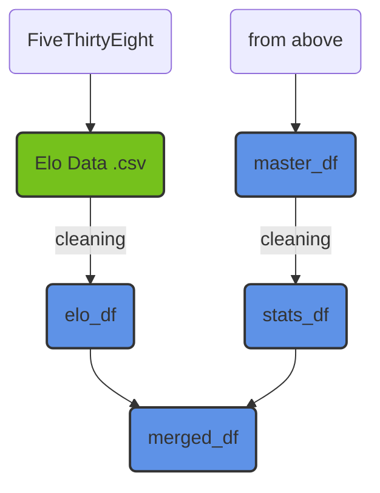

### Work Flow - Game Stats Data Scraping & Cleaning

```mermaid
graph TB

classDef tracker fill:#ffa700,stroke:#333,stroke-width:2px;
classDef data fill:	#75c11c,stroke:#333,stroke-width:2px;
classDef df fill:#5e92e7,stroke:#333,stroke-width:2px,label-color:#ffffff;

trkr("Tracking Dict")
data("Data Container")
df("DataFrame")

class trkr tracker;
class data data;
class df df;
```

```mermaid
graph TB
classDef tracker fill:#ffa700,stroke:#333,stroke-width:2px;
classDef data fill:	#75c11c,stroke:#333,stroke-width:2px;
classDef df fill:#5e92e7,stroke:#333,stroke-width:2px,label-color:#ffffff;

ts(Team Season Page)-->tsh(HTML)
ts-.->tsd("season_dict[year] = list of teams")

tsh-->shd("season_html[team-year] = html")
shd-->tsdf("team-season df")
tsdf-->mdf("master_df")

tsh-->bxh("Boxscore href's")
bxh-->bxd("bxsc_dict[team-year] = bxsx_href_list")
bxd-->hrefd("href_dict[href] = 1")
bxd-->bxdf("bxsc_df")
bxdf-->mdf

class tsd tracker;
class shd data;
class bxhl data;
class bxd data;
class mdf df;
class tsdf data;
class bxdf df;
class hrefd tracker;
class elodf df;
```

### Further Data Cleaning & Merging

```mermaid
graph TB
classDef tracker fill:#ffa700,stroke:#333,stroke-width:2px;
classDef data fill:	#75c11c,stroke:#333,stroke-width:2px;
classDef df fill:#5e92e7,stroke:#333,stroke-width:2px,label-color:#ffffff;

fte(FiveThirtyEight)-->elocsv
elocsv(Elo Data .csv)--cleaning-->elodf(elo_df)
elodf-->mrgdf(merged_df)
st(from above)-->mdf
mdf(master_df)--cleaning-->statsdf(stats_df)
statsdf-->mrgdf

class elocsv data;
class mdf df;
class relodf data;
class elodf df;
class statsdf df;
class mrgdf df;
```

- 